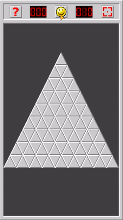
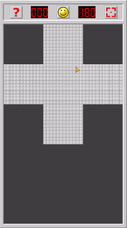
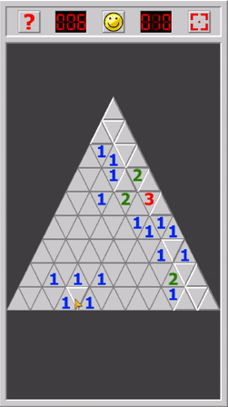
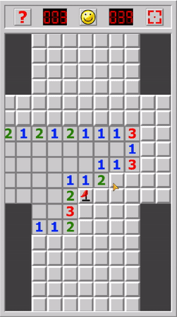

# Minesweeper- Shapes | Mobile Puzzle Game

Code avaiable upon request.

[Play Store: Minesweeper- Shapes](https://play.google.com/store/apps/details?id=com.charizard832.shapesweeper)

Minesweeper- Shapes is a cross-platform mobile Minesweeper app built in Java with libGdx. Apart from the traditional Minesweeper experience, Minesweeper- Shapes offers two new custom board types for players to learn and enjoy. There is a simple currency system that allows players to continue games after making a mistake, as well as a help button that shows the general guidelines of where mines can appear around tiles. Along with a smooth zooming and panning system, there are currently a total of 12 different game modes across 3 different board types.

## Features
 - [Three Board Types](#board-types)
   - Traditional rectangles
   - Triangles
   - Plusses
 - [Four Game Difficulties](#game-difficulties)
 - [Smooth zooming and panning](#panning-and-zooming)
 - [High Score System](#high-score-system)
 - [Flag System](#high-score-system)
 - [Currency Continue system](#continue-system)
 - [Scalability](#scalability)

#### Board Types

Minesweeper- Shapes features the traditional rectangle board minesweeper experience along with two new board types- triangles and plusses. These are implemented using the Model-view-controller design pattern. The models contain information about the boards themselves, and include the custom mine generation and tile reveal algorithms. The views contain the information on how to draw each board type. The controllers combine these two and handle touch input to complete the functionality of the boards.

#### Game Difficulties
There are four different game modes for each of the boards- easy, medium, hard, and expert. Each board is given a width, height, and number of mines in order to be generated. Preset values for these variables are set in a Constants file for each of the game modes for each of the board types. 

#### Panning and Zooming

Minesweeper- Shapes manipulates a camera to handle panning and zooming, rather than moving the tiles of the boards themselves. There are effecient calculations in the zooming algorithm to allow players to pinch zoom in and out of specific points on the board, rather than only allowing a center-focused zoom. This is done by manipulating the viewport of the camera- through changing its size and panning it depending on the focal point of the player's pinch. There is also a button to reset the camera back to its default position.

#### High Score System
Whenever the player begins solving a board, a timer shown on the top left counts the number of seconds it takes for the player to complete the board. Each game mode of each board type stores an individual high score for how fast the player completes the board.

#### Flag System

A classic part of traditional Minesweeper is the flag system. Players can "flag" tiles to mark places they think the mines are. Minesweeper- Shapes allows players to press and hold on a tile to flag it. There is also a counter on the top left that shows the number of total mines on the board minus the number of flagged tiles. This helps players know potentially how many mines may be left on the board.

#### Continue System

Every time the player either taps on a mine or completes the board, they will gain in-game currency based off of how many mines they correctly identified. In the case of a game-over, the player receives the amount of mines correctly flagged. In the case of a completed board, the player will gain the total amount of mines on the board, regardless of whether they were flagged or not. The player can either use 100 of the currency or watch a video ad to continue solving a board in the event of a game-over.

#### Scalability
Minesweeper- Shapes allows for new board types to be easily implemented due to the MVC pattern design. Along the same lines, new and custom parameters for game modes could also be added to the game. There is also potential for different tile skins, as the board data is not affected by the way the tiles are drawn.

## Privacy Policy
This app does not collect any data.
