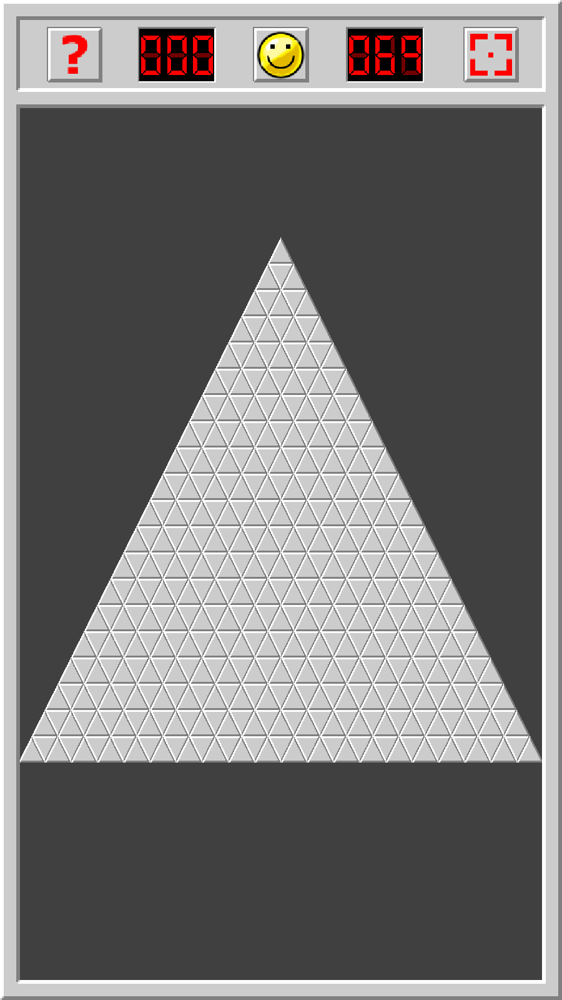

# Minesweeper- Shapes | Mobile Puzzle Game

[Play Store: Minesweeper- Shapes](https://play.google.com/store/apps/details?id=com.charizard832.shapesweeper)

Minesweeper- Shapes is a cross-platform mobile Minesweeper app built in Java with libGdx. Apart from the traditional Minesweeper experience, Minesweeper- Shapes offers two new custom board types for players to learn and enjoy. There is a simple currency system that allows players to continue games after making a mistake, as well as a help button that shows the general guidelines of where mines can appear around tiles. Along with a smooth zooming and panning system, there are currently a total of 12 different game modes across 3 different board types.